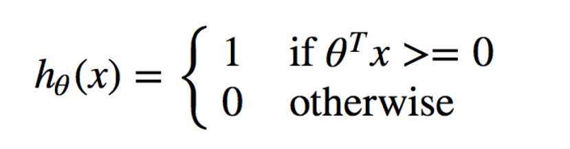
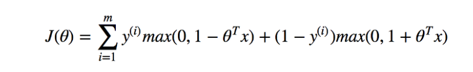
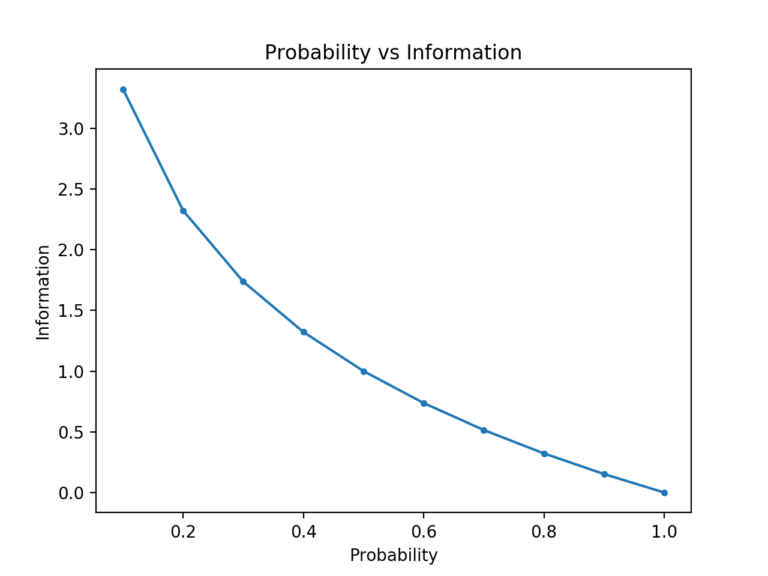

# DataSciencePosts

## Machine Learning

### Type I & II errors

. Type I error: false positive. False positive rate = FP/FP + TN. I.e. the percentage
of negative samples predicted as positive. Alternatively, it is the rate of falsely reject
the null hypothesis.
. Type II error: Non-rejection of a false null hypothesis. Namely False negative rate.

### Bagging and boosting

### Naive Bayes

. Naive Bayes is based on the assumption that the features or variables are independent of each other.
However, in real world, the variables are not always independent of each other.

### SVM

**Hypothesis**: when θᵀx >= 0, predict 1, otherwise predict 0.

When data points are just right on the margin, θᵀx = 1, when data points are between decision boundary and margin, 0< θᵀx <1.

**Loss function**: SVM gives some punishment to both incorrect predictions and those close to decision boundary ( 0 < θᵀx <1).

[**RBF Kernel**](https://scikit-learn.org/stable/auto_examples/svm/plot_rbf_parameters.html#sphx-glr-auto-examples-svm-plot-rbf-parameters-py) (radial basis Kernel):
A low C encourages a large margin, therefore a simpler decision function. For large values of C,
a smaller margin will be accepted if decision function is better at classification.

### Decision Tree

**Pruning**: Pruning can occur in a top down or bottom up fashion. A top down pruning will traverse nodes and trim subtrees starting at the root, while a bottom up pruning will start at the leaf nodes.

- **reduced-error-pruning**:
One of the simplest forms of pruning is reduced error pruning. Starting at the leaves, each node is replaced with its most popular class. If the prediction accuracy is not affected then the change is kept. While somewhat naive, reduced error pruning has the advantage of simplicity and speed.
- **Cost complexity pruning**:

### PCA

## Deep Learning

### activation function

softmax:

### Loss function

#### cross-entropy

Entroy is the the number of bits required to transmit a randomly selected event
from a probabilty distribution. A skewd distribution has a low entropy whereas a
distribution where events have equal probabilty has a larger entropy.

Entropy for an event: H(x) = -log(p(x))

Entropy for a random variable H(x) = -sum(each k in K, p(k)*log(p(k)))

For binary classification: `H(P, Q) = – (P(class0) * log(Q(class0)) + P(class1) * log(Q(class1)))`

[**Multi-class classification**](https://machinelearningmastery.com/cross-entropy-for-machine-learning/):
The number of nodes in the last layer should be equal to the number of classes.

- Calculate the entropy between predicted prob and ground truth for each class
- Average the cross entropy

https://github.com/YingxuH/DataSciencePosts/blob/master/src/cross_entropy.py#L10-L16

#### log likelihood

#### Newton's Method

Similar to Gradient Descent, we firstly take the partial derivative of J(θ) that is the slope of J(θ),
and note it as f(θ). Instead of decreasing θ by a certain chosen learning rate `α` multiplied with f(θ) ,
Newton’s Method gets an updated θ at the `point of intersection of the tangent line of f(θ) at previous θ and x axis`.
After amount of iterations, Newton’s Method will converge at f(θ) = 0.

### Overfitting:

#### Batch normalization

**Definition**

Backpropagation assumes the othher layers do not change while it updates the parameter
for the layers. Because all layers are changed during an update, the update procedure
is forever chasing a moving target.

For example, the weights of a layer are updated given an expectation that the prior
 layer outputs values with a given distribution. This distribution is likely changed after the weights of the prior layer are updated.

* Forward Learning
* Calculate gradient based on the previous batch input
* Input from the next batch may have a different distribution where the gradient
does not apply.

**Approach**

standardizing the activation of the prior layers. Thus, the assumption about the  spread
and distribution made by the next layer will not change, at least not dramatically.

> [!NOTE]  
> standardization: rescaling the data to have a mean of zero and std of one. Substract by mean and divide by deviation.

**Effect**

* Speed up the training process.
* reducing generalization error, like regularization.
* Makes the training more stable, thus allows larger learning rate.
* works well with optimization performance, especially for cnn and networks with
sigmoidal nonlinearities.

**Complexity**

The number of hidden nodes will affect the training outcome.
How to decide the number of units?

### Convelutional Nerual Network

#### RNN

##### Number of units:

> [!NOTE]  
> [Keras Embedding layer](https://keras.io/layers/embeddings/):
Embedding(input_dim, output_dim, input_length)

> [!NOTE]  
> input_dim:
size of the vocabulary, maximum integer index + 1

> [!NOTE]  
> output_dim:
Dimension of the dense word embedding.

Cannot use batch normalization in RNN as it does not consider the recurrent part
of the network.

### Related Work
