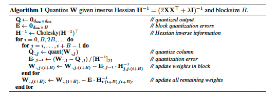

# Gradient Boosting Tree and its variants.

Constructing the normal tree structures takes the information theory approach, and splits on each node to maximize the information gain or entropy. Each leave node has a value of the average $\overline{y}$ value or majority class of the training instances falling into that leave. 

Different from CART and previous tree structures, gradient-boosting tree structure
- makes splits based on the gradients learned from previous trees and tries to fill the residual (gradients!) made from the previous model. 
- Each entry from the training dataset bears a gradient calculated from the previous trees and the ground truth labels. They are used as statistics to find the best split, as well as calculate the optimal weights for created nodes. Note that GBDT no longer uses $\overline{y}$ as the leave value. 
- although named as "gradient", GBDT is still just a tree algorithm focused on splitting data into different decision boundaries. Unlike the typical use of gradient in Neural Networks, GBDT calculates gradient for each data instance $\frac{\delta{L(y_{i}, \hat{y}\_{i}^{t-1})}}{\delta{\hat{y}\_{i}^{t-1}}}$, while neural networks calculate gradients for each parameter. Hence, GBDT works by adding new trees to directly alter $\hat{y}_{i}$, while neural networks update the weights.  
> :question: Typical: why NN doesn't use a second derivative?
- For regression trees, the gradient-based leave weights are prediction values.
> :question: What about the classification tree?
- It is worth noting that all the tree structures used in the GBDT structure, including CART, use the `binary split` approach, i.e., split one node into two children.  

> :question: Do all tree structures do the binary split? 

## Heuristics

- DART achieves better shrinkage than GBtree, as they adopted dropout.
- Applying more trees and a slower learning rate could be a good approach. 
- Large-dimension categorical data will increase the computation time significantly. Especially for long-tailed features, which will cause overfitting in that field. Could consider merging categories and various numerical encoding methods. 
- Tree depth, minimal leave size affect the performance a lot. Help reduce overfitting. 

## XGBoost 

### Tree construction based on boosting and second-order gradients

The loss function can be formulated as: 

Using Taylor expansion, the formula can be transformed into the following equation. Note that the expansion is just an approximation to the solution. 

To further simplify, 

Where $T$ represents the number of leaves, and $I_{j}$ is actually a set of training instances falling into leave $j$. 

Given the split been made, the weights for the emerged nodes could be 

Note that they might not be realized except in the last iteration of tree construction. Showing their value here just to define the gradient score of the entire sub-structure: 

> [!note]
> Normalization is implemented here to prevent overfitting. Works like pruning. We could include both L1 and L2 for the real implementation. 

Through the additive tree construction process, XGBoost also supports: 
- tree shrinkage. This works like a learning rate, a small multiplier for the weights in each tree to prevent each tree from growing too sophisticated. It alleviates overfitting, or "variance" of the model. It also allows building more trees.
- column subsampling. This is a "bagging" like strategy applying to features, again for the sake of reducing overfitting or lowering model variance.   

# Split finding strategies

#### Exact Greedy Algorithm

Pre-sort the data according to each feature value. The data will be saved by each compressed column (CSC) in in-memory units (block), with each feature sorted. According to the original paper, This lowered the original time complexity from $O(Kd \\|x\\|\_{0}log(n))$ to $O(Kd\\|x\\|\_{0}) + O(\\|x\\|\_{0}log(n))$, where $K$ stands for the number of trees and $d$ stands for the maximum depth of trees.

> :question: I suspect they omitted the number of features in this notation. 

> [!note]
> :question: This method only supports layer-wise tree construction. The algorithm scans the entire dataset and collectively decides the split points for all leaves, but I am unsure about the details. Also, this approach doesn't support leave-wise tree construction, possibly due to this. 

#### Approximation Algorithm

Instead of scanning through the entire dataset, you can propose some quantile candidates and only split by them. The quantile finding time complexity could be $O(n.\\#candidates)$, if using the `quick select` algorithm. Furthermore, it reduces time complexity of split finding from $O(n)$ to $O(\\# candidates)$ and pre-sorting from $O(nlog(n))$ to $O(nlog(\\#candidates))$. However, these time complexities are further optimized by introducing the block structure. 

> [!important]
> Given the block structure, the quantile finding step is optimized to take only a linear scan over the feature, which is $O(n)$. 

> [!note]
> $O(nlog(\\# candidates))$ is taken in the aggregation step, where you assign the rest of the data into the bins through binary search. This is claimed to be further optimized into linear complexity $O(n)$ with the block unit and novel data structure. 

##### Weighted Quantile sketch

The weight of each data entry is not simply 1 in this case. Instead, a rank function based on the gradients is defined as the weights:

The intuition here is to reduce the impact of low-gradient entries during split finding. Intuitively, the low gradient and high gradient points will be clustered in terms of their $x$ value. Doing this will insert more candidate grids into high-gradient clusters, resulting in a more granular split comparison among the high-gradient $x$ values and, thus, a better resolution regarding the loss reduction. This design has the same spirit as the GOSS algorithm.  

> [!note]
> :question: The authors created a novel distributed data structure supporting the merge and prune operations, which allows the use of block structure. Needs further investigation

##### Sparse-aware design

XGBoost deals with the split of missing values or 0 values through learning. I.e., it will try to allocate entries with missing values to both the left and right sides and then decide the optimal direction by comparing the structure score. The learned default direction will allocate all the missing entries encountered at the inference time.

Additionally, this strategy reduces the time complexity factor of split finding from $O(n)$ to $O(\\|x\\|\_{0})$, which is the number of non-missing data for each feature. It is done by actively pushing the data to the left set or right set, while leaving the rest of the data, including the missing ones, to the other set. Details are here: 

##### Global vs local proposals

The local variant refers to re-proposing split candidates after each split, which is apparently more fine-grained and accurate. As a result, more candidates are needed for the global counterpart to achieve similar performance. 

> [!note]
> A reminder that the exact greedy approach doesn't need proposals.

### Block structure

As mentioned in the previous sections, the data is stored in `in-memory unit` referred to as `"block"`. Each column is individually saved in the `CSC` format with a mapping from the index to its second-order gradient. 

For the exact greedy approach, all the data is saved into one block, and the split finding for all leaves is done simultaneously. 

For the approximation method, different subsets of rows will be stored in different blocks, and they can be merged back whenever necessary. This data structure will reduce the quantile finding complexity from $O(n.\\#candidates)$ to $O(n)$, and the histogram aggregation complexity from $O(nlog(\\#candidates))$ to $O(n)$, except that you still need to sort the data inside each block. 

> :question: How do we interpret the step of doing split finding for all leaves collectively?

> :question: Don't really know how this is achieved, though.

> [!note]
> The real implementation of XGBoost supports the histogram-based proposal method as well. 

### Time complexity 

- Baseline without pre-sorting: $O(Kd \\|x\\|_{0}log(n))$
- Exact Greedy: $O(Kd\\|x\\|\_{0}) + O(\\|x\\|\_{0}log(n))$
- Approximation approach: $O(Kd\\|x\\|\_{0})$ for the tree construction $+ O(n)$ for the optimized quantile finding $+ O(\\|x\\|\_{0}log(\\#candidates))$ the proposal aggregation. 
- Ultimate block optimized approach: $O(Kd\\|x\\|\_{0}) + O(\\|x\\|\_{0}log(max_{size}(block)))$

> :question: I don't really understand the last approach though.

## Light GBM

### GOSS 

Taking gradients as the weights of the data points. So basically, this is to ignore the detailed distribution of small gradient data points (they are trivial to your decision-making). Can it be considered as the non-support vector? same idea applied in the llm.int8()!

Actually, they are already squeezed by the approximation method proposed in XGBoost. 

> :question: The re-weighting idea is probably based on the assumption that the distribution of gradients is related to the distribution of x or y. This is possible while adding trees, as your model could be biased in the middle of the learning. 

Based on the following analysis, minimal loss will be achieved with balanced splits and a large enough dataset. It could be theoretically approved that the gradient-based sampling will outperform random sampling and reduce the overfitting or variance of the model, hence increasing the generalization performance. However, GOSS is only marginally better than SGD. 

> [!note]
> SGD should be much faster than GOSS since it doesn't need to sort.

> [!important]
> The time complexity is not linearly correlated with the sampling rate $b$, as you still need to compute the gradients and predictions on the full dataset

### Exclusive Feature Bundling

- Some features never take nonzero values simultaneously.
- XGBoost already reduced the approximation candidate building time to $O(\\#data.\\#feature)$, and now is $O(\\#data.\\#bundle)$
- Imagine a graph coloring problem with vertices as features and edges indicating features are not mutually exclusive. 
- Allowing a small fraction of conflicts $\gamma$ $will improve the efficiency of the approximation step but lose some accuracy. We need to balance these two factors. 

> [!note]
> Set $\gamma$ carefully when the dataset is large, as $\gamma$ is actually a ratio. The `number` of conflicts is proportional to the loss of accuracy. 

- As the graph color problem is NP-hard, a greedy approach is used by sorting the features by their degrees and union them into sets by verifying the rate of conflicts (the edges). This takes $O(\\#feature^2)$ time. 
- To further speed up, order by $\\# nonzeros$ instead of degree. 
- Assign the original features to different ranges of the new feature for implementation. For the histogram-based approximation, assign them to different bins. 

> [!important]
> To achieve a sparsity-aware histogram-building algorithm, zero values are ignored. 
