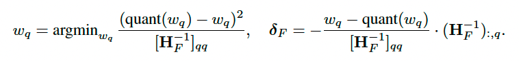
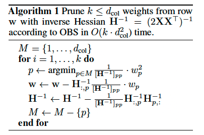

## Table of Content
- [Table of Content](#table-of-content)
- [Heuristics](#heuristics)
- [Architecture](#architecture)
  - [Embeddings](#embeddings)
    - [Positional Embeddings](#positional-embeddings)
      - [ROPE](#rope)
  - [Attention](#attention)
    - [Flash Attention](#flash-attention)
    - [Sparse Attention](#sparse-attention)
  - [Point-wise Feed forward layer](#point-wise-feed-forward-layer)
- [Pretraining](#pretraining)
  - [Pre-training objectives](#pre-training-objectives)
    - [Denoising objective](#denoising-objective)
    - [Language model objective](#language-model-objective)
- [Parallelism](#parallelism)
  - [DeepSpeed (ZeRO)](#deepspeed-zero)
- [Finetuning](#finetuning)
  - [Gradient Accumulation](#gradient-accumulation)
  - [Gradient Checkpoint](#gradient-checkpoint)
- [Quantization](#quantization)
  - [LLM.int8()](#llmint8)
  - [GPTQ](#gptq)
  - [AWQ](#awq)
  - [Llama CPP](#llama-cpp)
- [Stanford CS244N](#stanford-cs244n)
- [Experiments log](#experiments-log)

## Heuristics
- gradient checkpointing can greatly reduce the memory cost
- distributed training doesn't support gradient checkpointing.
- Both Lora and p-tuning v2 are likely to cause the model to overfit to your sft dataset. Recommended to add common sense dataset. More details [here](https://zhuanlan.zhihu.com/p/622810394)
- The target modules required by the LoRA config must be consistent with the parameter names of each particular LLM. E.g. `k_proj`, `q_proj` for Llama.
- `model.enable_input_require_grads()`: make sure the input embeddings get updated during training. Useful for adapter-based finetuning like LoRA.
- LLM like Llama processes obviously slower when the input tokens are more than 1024. Maybe some internal processing unit has a size of 1024? Like anything longer than that will require an additional processing unit?
- `huggingface.trainer` provides a `predict` method to run prediction naturally, with all the deepspeed configurations. Dig in to find out the original code with deepspeed.

## Architecture
Up to 2023, most of the trending LMs follow the transformer architecture. 

- **Encoder**: Fully visiable structure. No Causal mask.
- **Decoder**: Tokens appearing at subsequent times are masked.
- **Predix LM** (T5): Tokens representing the input prefix/instruction are fully visible to each other, while tokens in the real input can only see the preceding tokens.

### Embeddings 
Compared to traditional RNNs, the sequential feature of the input is not taken care of by the recurrent process. On the contrary, positional embedding handles this. 

The embedding matrix is shared between the input embedding and the output classification process.

#### Positional Embeddings

##### ROPE 

### Attention
> [!NOTE]  
> It Might be quite obvious, but I still want to note here: shared matrix is used for each token in the sequence.

**Time Complexity** (scaled dot product attention): 
- Linear projection from embedding to K, Q, V: $O(N.d^2)$, assuming the simplest case without multihead set up.
- Q x K for the attention matrix: $O(N^{2}.d)$
- Softmax x V for the updated values: $O(N^{2}.d)$
- In total: $O(N^{2}.d + N.d^2)$

> [!NOTE]  
> For additive attention, the similarity function can be represented as $s(Q, K) = V^{T}tanh(W[Q;K])$, where $W$ should has the shape of $d \times d$ and $V$ of $d \times N$, which results in a time complexity of $O(N^{2}.d^{2})$

#### Flash Attention

- The attention operation is bottlenecked by the memory I/O speed of the HBM.
- Split the input into blocks and make several passes over input blocks. Perform the softmax function incrementally without saving the entire matrix to memory. 
- Store the softmax normalization factor for backward passing, which is faster than directing reading the attention matrix from the memory.

#### Sparse Attention

### Point-wise Feed forward layer
- **Expand layer**: (d_model, d_ffn)
- **Contraction layer**: (d_ffn, d_model)

## Pretraining 
### Pre-training objectives
#### Denoising objective
corrupt the input sequence and reproduce it in the output.
- **Bert** (masked language modeling, MLM): corrupts 15% of the tokens. 80% of the corrupted tokens are replaced with a special mask token, 10% are replaced with a random token, and the remaining 10% are unchanged. The task is to reproduce the entire original sequence.
- **Mass style** (T5): replace corrupted tokens with the special mask token.
- **Replace style** (T5): replace the consecutive span of corrupted tokens with a single mask token, and only predict the concatenated corrupted spans. Note that the specific mask token prefixes each span in the target span.
- **drop style** (T5): drop the corrupted tokens from the input.

> [!NOTE]  
> **Replace style** and **drop style** might speed up the training process and require lower computational cost, as the target sequence is shorter. (How to define shorter as still one token has to be produced each time?)

#### Language model objective
> ❓ Training will be done at once for all time steps. For example, given the input sequence, each time step will output logits for the next token for speed up.

- **Teacher Forcing**: Each token is predicted given the input tokens extracted from the ground truth sequence. **Likely to cause repetition in decoding.**
- **Curriculum Learning**: Randomly choose to use the ground truth output or the generated output from the previous time step as input for the current time step.

## Parallelism

> :question: Directly use `DDP` might be faster than deepspeed? Probably simply stage-0?

### DeepSpeed (ZeRO)
- **Stage 0**: Same as Distributed Data Parallel, since only data will be paritioned. 
- **Stage 1**: 
- **Stage 2**:
- **Stage 3**:
- **Zero Infinity**: It extends Zero-3 to SSD offloading, with the support of NVMe protocol. It has more effective communication and bandwidth utilization compared to Zero-3. Due to the smart paritioning and tiling algorithm, there is only small amount of communication required for offloading data to SSD. This stage reuquires stage-3 to be enabled. 

**Single card improvement**

- ZeRO-offload is able to reduce memory usage even for single GPU card by offloading to CPU. 
- Improved fragmented memory management. 

**Mutli-node training**

DeepSpeed will automatically propagate all the related environmental variables to all relevant nodes, you can also specify any other variables that you want DeepSpeed to propagate before running the program. However, the detailed python environment and the assets won't be automatically shared. Some manual work might need to be done. 

**Parameters**

There are a wide range of common parameters between huggingface transformers and deepspeed configuration. Whenever a value for any parameter has been set in the huggingface config, you can pass `auto` in as the deepspeep config value. 

- `overlap_comm`: whether or not overlap the reduction of the gradients with backward computation. Recommended to set as `True`.
- `reduce scatter`: Set to true to distribute the gradients of each partition to each device, otherwise will use allreduce. Recommended for stage 2. 
- `use_node_local_storage`: set to `true` if save the relevant model states on each local machine instead of performing the gather operation. Equivalent to the `save_on_each_node` argument of the huggingface trainer.
- `allgather_bucket_size` or `reduce_bucket_size`: the number of elements transmitted at a single time during the gather/reduce process. larger bucket size will have faster communication speed but larger memory footprint. Affects the memory requirement for the gather/reduce process.
- `stage3_max_live_parameters`: the maxnimal number of parameters resident on each GPU before releasing. Smaller values use less memory, but requires more communication cost.
- `stage3_max_reuse_distance`: Do not release a parameter if it will be reused within this threshold of parameters. Smaller values use less memory, but requires more communication cost. Useful for the activation checkpointing strategy.

> [!note] 
> Try to reduce `stage3_max_live_paremeter` and `stage3_max_reuse_distance` for OOM situations. They won't affect too much of the communication and overall performance unless actication checkpointing is used. They share the same memory buckets, where a value of 1e9 will likely take ~2GB memory.

- `stage3_gather16bit_weights_on_model_save`: Gather the weights partitioned across multiple GPUs. :question: is this necessary for multi-node training?
- `stage3_param_persistence_threshold`: Do not partition paramters smaller than this threshold. Smaller values use less memory but will incur more communication cost. Set a large value to reduce the communication latency if you have enough memory. E.g. $6 \times hidden\_size^2$
- `sub_group_size`: Controls the granularity of the optimizer update steps. It also controls the granularity of the CPU-offloading process.
- `amp`: might improve the resource management process. 

> [!important]
> Switch to `bf16` or `fp32` once the loss becomes NaN.

## Finetuning

### Gradient Accumulation
- perform backward propagation at each step, accumulate the gradients for each trainable tensor.
- The performance might deviate from the large batch method when batch normalization is [applied](https://jhc.sjtu.edu.cn/~bjiang/papers/Huang_CCGrid2023_GA.pdf). 
- One should not blindly increase the accumulation steps as a having a too large batch size might also slow down the [convergence](https://jhc.sjtu.edu.cn/~bjiang/papers/Huang_CCGrid2023_GA.pdf). 

### Gradient Checkpoint

## Quantization
It means a projection from a set of indices to real domains. Typically, people save weights in 32-bit for storage and calculate gradients in 16-bit. 
FP32 and bFP16 (BrainFP16) don't have differences in their ranges.

- **8-bit quantization**: mixed-precision matrix decomposition: 8-bit quantizes the normal states & weights and leaves the outliers unchanged.
- **Normal float 4**: In layman's terms, instead of using the normal "sign-exponent-mantissa" schema to represent actual values, the normal float data type keeps an index value
pair where the kth value is the kth quantile of the source tensor. It's information-theoretically optimal, as they claim!

### LLM.int8()

- It generalizes the block quantization into row/column wise quantization.
- Currently quite slow duel to these [reasons](https://github.com/TimDettmers/bitsandbytes/issues/6#issuecomment-1211345635): 
  - The current CUDA kernel is not optimized for outlier extraction.
  - the int8 and fp16 matrix multiplication is run in sequential manner rather than parallel manner. 
  - fp16 matrix multiplication kernel not optimized for extreme matrix sizes. 
  - Interesting view point: int8 matmul might not be much faster than fp16 operations as its difficult to saturate the GPU cores for small models. However, int8 still has overhead occured by the offset parameter. 

### GPTQ
GPTQ is dedicated to quantizing the parameters and updating the weights of other precise parameters to achieve minimal loss derivation compared to the original loss. Generally, any quantization method, such as 8bit, 4bit, etc., can be applied in this case.

Firstly, the optimization approach focuses on each layer: a $d_{out} \times d_{in}$ weight $W$. Secondly, the GPTQ proposes several adjustments based on the Optimal Brain Quantization (OBQ) approach to improve its efficiency and precision. 

**Summarization of OBQ**

For each row of $d_{out}$ in $W$, calculate a Hessian matrix $H_{F}$ for the set of intact input weights $F$, where $H_{F} = 2X_{F}X_{F}^{T}$. Find the optimal greedy-optimal weight $w_{q}$ to quantize next and the updates to the remaining weights $\delta_{F}$ by the following formula. 

The process is done iteratively for each input parameter and each output parameter, based on the observation that there is no hessian interaction between different output weights, or $\frac{\partial^{2}f}{\partial{w_{i,j}}\partial{w_{i',j}}}$ = 0. The process takes $O(N.d_{in}^2)$ time to construct the Hessian matrix, $O(d_{in})$ time to find the next optimal parameter, $O(d_{in})$ time to update the remaining parameters, and $O(d_{in}^2)$ time to update its inverse $H_{F}^{-1}$ for each step of removing the row and column $p$. The whole process takes $O(N.d_{in}^2 + d_{out}.k(d_{in}^2 +d_{in}^2))$ time, or simply $O(d_{out}.k.d_{in}^2)$ or $O(d_{out}.d_{in}^3)$ where $k$ stands for the number of input weights you want to quantize for each output weight. Remember the Hessian matrix only needs to be calculated once for all rows. The detailed algorithm is shown below.

**Adjustments**

- **Arbitrary quantization order**: Greedily searching for the next optimal weight to quantize turns out with only marginal benefits over following an arbitrary order. Hence the cheap way is to simply follow the same order to quantize the input parameters for all the output rows. The $H^{-1}$ update process will be the same for all the rows, resulting in a time complexity of $O(d_{in}(d_{out}.d_{in} + d_{in}^2))$, where $O(d_{out}.d_{in})$ is time cost of updating the weights of each row at each time step. Simply, the time complexity can be written as $O(max({d_{out}.d_{in}^2, d_{in}^3)})$.
- **lazy batch updates**: Batch process weights update process for a block of columns. This is based on the intuition that updating the entire weight matrix everytime quantizing one column will trigger too much data I/O process, which might be bottlenecked by the memory bandwidth. During calculation, weights within each batch will be fully updated first before combining their updates and applying to the rest of matrix. Hence, the time cost on updating weights will change from $O(d_{out}.d_{in}^2)$ to $O(d_{out}(\frac{d_{in}}{B}.B^2 + \frac{d_{in}^2}{B}))$, where the first term represent steps calculating the within-batch process and the second term represents the steps updating the weights outside batches. When B is approaching $d_{in}$, the I/O bottleneck caused by the second term will be deminished while the first term turns into the heavy one. On the contrary, the cost reduction on the second term would be trivial if B is too small, so we need to considering the balance between the two terms while determining the value of B. 128 is used in the paper.
- **Cholesky Reformation**: The inverse Hessian matrix can be pre-computed leveraging Cholesky decomposition, further reducing the total complexity to  $O(d_{out}.d_{in}^2)$.

### AWQ

### Llama CPP

- [original 4-bit quantization](https://github.com/ggerganov/ggml/pull/27). Intuitively, $QK_0$ stands for absmax quantization while $QK_1$ stands for zero-point quantization. The extra offset parameter in zero-point quantization grants more freedom for the quantized range and thus could save more range, but at a higher computation cost.
- [The original range as a scaling parameter can be adjusted](https://github.com/ggerganov/llama.cpp/issues/397). Based on [this paper](https://arxiv.org/pdf/1712.05877.pdf), people tends to use moving averate for the max and min of activations. 

> [!NOTE]  
> You can actually determine the range by reconstruction RMSE, etc. Further discussed [here](https://github.com/ggerganov/llama.cpp/pull/835) and [here](https://github.com/ggerganov/llama.cpp/pull/896).

- [k quantization](https://github.com/ggerganov/llama.cpp/pull/1684): It uses various different set ups of block quantization, with variances of applying a mixture of quantization strategy on different tensors.

> [!NOTE]  
> The general insight is that the lower the quantization bits, the faster speed the model will be. 

## Stanford CS244N

> ❓ attention quadratic complexity problem? since increase the context window will cause incur higher computational complexity

> ❓ mT5: exact same model but trained on multilingual corpus.

> ❓ worst case overfitting: memorize key information.

> ❓ language model perplexity?

Reading list: 
- Attention is all you need
- Exploring the Limits of Transfer Learning with a UnifiedText-to-Text Transformer
- mT5: A Massively Multilingual Pre-trained Text-to-Text Transformer
- Scaling Instruction-Finetuned Language Models
- How Much Knowledge Can You Pack Into the Parameters of a Language Model?
- How Can We Know What Language Models Know?
- MULTITASK PROMPTED TRAINING ENABLES ZERO-SHOT TASK GENERALIZATION
- Emergent Abilities of Large Language Models
- Don’t Stop Pretraining: Adapt Language Models to Domains and Tasks

## Experiments log
| Model | Quantization |Input | Input Tokens | Output Max Tokens | Time per request | RAM usage |
| -------- |-------- | --------- | -------- | --------- | -------- | --------- |
| LLM-2-7b-chat-GGUF | Q3_K_S |        | 36 | 16 | 1.7s | 0.33G |
| LLM-2-7b-chat-GGUF | Q3_K_S |        | 36 | 32 | 3.5s | 0.4G |
| LLM-2-7b-chat-GGUF | Q3_K_S |        | 36 | 128 | 13.7s | 0.4G |
| LLM-2-7b-chat-GGUF | Q6_K |       | 36 | 32 | 4.6s | 0.3G |
| LLM-2-7b-chat-GGUF | Q6_K |       | 36 | 128 | 22.0s | 0.4G |
| LLM-2-7b-chat-GGUF | Q8_0 |       | 169 | 16 | 3.0s | 0.4G |
| LLM-2-7b-chat-GGUF | Q8_0 |       | 36 | 16 | 2.9s | 0.3G |
| LLM-2-7b-chat-GGUF | Q8_0 |       | 169 | 32 | 5.9s | 0.4G |
| LLM-2-7b-chat-GGUF | Q8_0 |       | 36 | 32 | 5.8s | 1.7G |
| LLM-2-7b-chat-GGUF | Q8_0 |       | 169 | 128 | 24.0s | 2G |
| LLM-2-7b-chat-GGUF | Q8_0 |       | 36 | 128 | 24.0s | 2G |
