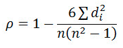
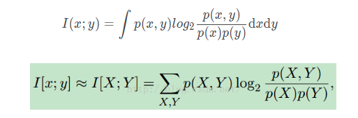
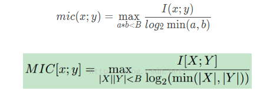
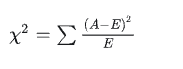

## regex

1. python regex: search: find something anywhere in the string and return a match object. match: find something at the beginning of the string and return a match object.
2. A greedy quantifier such as ?, *, +, and {m,n} matches as many characters as possible (longest match). A non-greedy quantifier such as ??, *?, +?, and {m,n}? matches as few characters as possible (shortest possible match).
3. \s will match \n, while '.' and ' ' will not.
4. lookahead (to the right of the pattern): positive ?= negative ?! (?=(<regex>)): capture character n-grams with step size = 1. 
5. (?:): non-capturing group.
6. []: "^": negate the characters following the caret. "-" means range. the usual meta characters are normal characters inside a character class. no need to be escaped. [more info](https://www.regular-expressions.info/charclass.html).
7. python double backslash: python interpret "\\\\" as single backslash "\\" .

## python GIL mechanisms

1. time out function on windows system:
```python
import concurrent.futures as futures

with futures.ThreadPoolExecutor(max_workers=1) as executor:
    future = executor.submit(<your_function_name>, *args, **kwargs)
    completion = future.result(<your_time_out_limit>)
    executor._threads.clear()
    futures.thread._threads_queues.clear()
```

## Linux

1. list stuff at the current directory with size: `ll -h`
2. list size recursively: `du -sh *`
3. `df -h` shows the amount of free space left on a file system


## Other
1. [metissa and exponent](https://www.storyofmathematics.com/glossary/mantissa/)
2. python type hinting: List, Dict, Any, etc.
3. kaggle API:
4. Decorator function with arguments: add a wrapper outside the decoration function (request retry).
   - can add double decoration function.
5. ignore warning context:

For fixed warning types:

```python
import warnings
from urllib3.exceptions import InsecureRequestWarning

def ignore_request_warning(func):
    def inner(*args, **kwargs):
        with warnings.catch_warnings():
            warnings.simplefilter(action="ignore", category=InsecureRequestWarning)
            return func(*args, **kwargs)
    return inner
```
For flexible warning types which could be input as arguments: 

```python
import warnings

def ignore_request_warning(warning):
    def decorator(function)
        def inner(*args, **kwargs):
            with warnings.catch_warnings():
                warnings.simplefilter(action="ignore", category=warning)
                return func(*args, **kwargs)
        return inner
    return decorator
```

6. bitsandbytes might has some problem with running no V100. Set with `torch.autocast("cuda"):` before training the trainer. [More info](https://github.com/TimDettmers/bitsandbytes/issues/240)
7. [Model save weight](https://github.com/huggingface/peft/issues/286#issuecomment-1501617281)
8. peft model merge and unload.
9. repeatition of data hurts naive bayes
why is naive bayes generative models? what is generative and discriminative model?
logistic classification can be viewed as nn, or directed graphical model! 
why crf is discriminative?
10. Volatile memory refers to RAM, normally used as primary storage. Non-volatile memory normally refers to the mass memory stored in hard disk drive. The NVMe protocol leverages the parallelism capability of the current SSD and achieved much shorter latency compared to the AHCI protocol based on HDD. 

## Heurisics
Linear model has a hard time dealing with 
- non-generalizable y variables (count, binary, duration, etc.)
- effects are not additive
- [A/B testing explained](https://zhuanlan.zhihu.com/p/68019926)

## Evaluation Metrics
- explained variance score: actually similar to $R^2$, except that $R^2$ didn't remove the systematic offset impact (it penalize when mean residual not equal to zero, while VE does not), thus, $R^2$ should be preferred.
- Adjusted R square: penalize the situation when data to feature ratio is small  
- The $R^2$ score, which is the coefficient of determination. $R^2 = 1- \frac{RSS}{TSS}$, or $\frac{ESS}{TSS}$, but not always (e.g. when the OLS model doesn't fit intercept).  
- MSE: larger values are amplified, sensitive to outliers for training. Able to tell performane on outliers for inference. 
- RMSE: same as MSE but the same scale as the input training data
- MAE: insensitive to outliers during training. Easy to interpret during inference (average error). Not good for differentiation due to the absolute value function. 

> [!note]
> RMSE, MSE, and MAE are all scale dependent, unable to compare across different dataset. 

## preprocesssing 

### Intercorrelated features: 

#### Why
- Might cause the model weights to have the wrong sign or implausible magnitudes.
- inflates the co-variance matrix, and reduce the significance of certain predictors (significantly increase the variance of coefficient).

> :question: the impact on performance?

- filter
- merge
- chunk test
- use good models -> ridge regression, sequential regression to reveal the cause-effect relationship.

### Feature Selection Criteria

- **pearson coefficient**: only deals with linear correlation. 

> [!note]
> easily reaches 0 when the 2D relationship is nearly vertical or horizontal.

- **spearman rank coefficient**: still only monotonic relationship. But the assumption is not strict as you can still try to detect the monotonic components from non-monotonic relations or you simply don't know anything about data. Below is the formula where $n$ is number of data and $d$ is the difference between paired ranks. 




- **mutual information coefficient**: robust against the form of relations and noises in data. If data is more concentrated in the x-y region, the $log$ term will depart further from 1, and the score is weighted by the probability again. Again increasing the buckets will increase the score, so normalize the score by the number of buckets. Can be interpreted as $D_{KL}(p(x, y)\\|p(x)p(y))$.
  


> [!note]
> Still mutual information at this step, unable to compare across features.



- **chi square information**: the correlation between categorical features. 




- **ANOVA**: test the covariance between the independent and dependent variable, the stats is $F$, comes with a $p$. Normally also used in LR to examine whether any of the coefficients is larger than 0.

- **Information Value**: between categorical and categorical features. [Based on WOE.](https://blog.csdn.net/kevin7658/article/details/50780391#:~:text=WOE%E7%9A%84%E5%85%A8%E7%A7%B0%E6%98%AF%E2%80%9CWeight,%E7%9A%84%E9%83%BD%E6%98%AF%E4%B8%80%E4%B8%AA%E6%84%8F%E6%80%9D%EF%BC%89%E3%80%82) The WOE value represents the difference between local logit to global logit, and its statistical significance can be quantified by the p-value from chi-square test. The multiplier term bears information about group size ($\frac{\\#yes}{total\\#yes} - \frac{\\#no}{total\\#no}$), which signifies the ratio between the category size and total number of data. The strength of the predictor can be quantified by the effect size stats.

- **Distance based coefficient**: 

> :question: more information needed

- **More to come...**

- **Variance Threshold**: just a baseline as the values could be just clustered around several pins. Difficult to set the threshold as well. 

- **Embedding method**: fit the target model with L1 norm to force the coefficients of trivial/inter-correlated features to zero. E.g. the lasso regression. 

> [!note]
> Relaxed Lasso: perform lasso twice with the second time removing L1 norm. The final prediction is made by a weighed sum of the first and second lasso models. This is to separate the feature selection process and converging parameters process for faster convergence and better capacity (don't underfit!). [More details here.](https://stats.stackexchange.com/questions/37989/advantages-of-doing-double-lasso-or-performing-lasso-twice)

### Encoding: 
- **Weight of Evidence (WOE) encoding**: the $log$ is used as you are calculating logit, or the logit relative to global logit, which could be long-tailed and skewed to the left. The $log$ transformation makes it normal.
