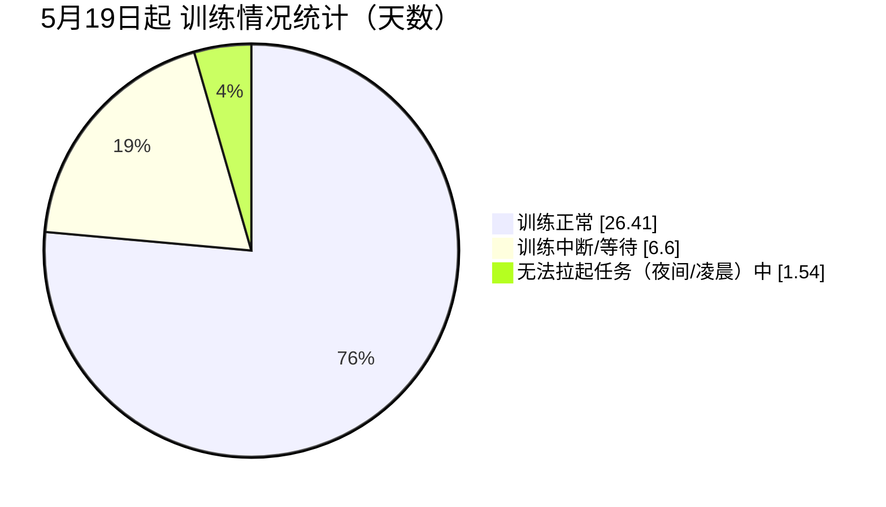

ling-1b-v1训练时采用数据切片、非共享存储方法。其中
* 5月8号-5月18号期间主要在预处理数据，并定位解决磁阵问题。
* 9TB数据共切分为13批，每批大約600~800GB。
* 共训练11轮（前9轮中每轮训练1批数据；最后两轮每轮2批数据）。
* 11轮训练中，由于故障中断:x:5次，人工中断:heavy_minus_sign:2次。加起来共拉起训练任务:heavy_check_mark:18次。
* 每次拉起任务时，由于工程/机器/平台排队问题:wrench:、或者夜间/凌晨等原因:zzz:，都有一定额外等待耗时。

