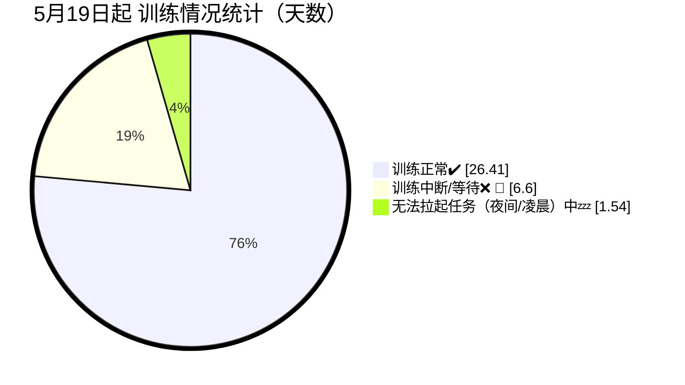

ling-1b-v1训练时采用数据切片、非共享存储方法。其中
* 5月8号-5月18号期间主要在预处理数据，并定位解决磁阵问题。
* 9TB数据共切分为13批，每批大約600~800GB。
* 共训练11轮（前9轮中每轮训练1批数据；最后两轮每轮2批数据）。
* 11轮训练中，由于故障中断 :x: 5次，人工中断 :heavy_minus_sign: 2次。加起来共拉起训练任务 :heavy_check_mark: 18次。
* 每次拉起任务时，由于工程/机器/平台排队问题 :wrench: 、或者夜间/凌晨等原因 :zzz: ，都有一定额外等待耗时。

| 时间 | 持续时间 | 训练状态 | 数据批次  （从0开始）| 节点 | 描述 |
| -- | -- | -- | -- | -- | -- |
| 2024-05-08 | -- | -- | -- | -- | 预处理数据，分词 |
| 2024-05-10 | -- | -- | -- | -- | 合并3000多个数据文件，每个文件合并后大概200G。|
| 2024-05-11 | -- | -- | -- | -- | 训练时速度不达标，速度只有大概8B/天，240卡。＜br>经过分析后是磁阵吞吐率不达标，更换磁阵需要到6月底。攻关非共享存储方案。 每台机器需要在本地硬盘放同样的数据，总体需要将9TB数据均匀切片。|
| 2024-05-19 09:55 | 17:10:31 | :heavy_check_mark: | 0 | 10 | 开始正常训练 |
| 2024-05-20 03:05 | 18:22:29 | :x: :zzz: :wrench: | 0 | -- | **交换机跳闸，前6小时为非工作时间，训练中断** |
| 2024-05-20 21:28 | 19:42:29 | :heavy_check_mark: | 0 | 14 | 机器部分恢复，用14节点拉起训练任务  没有读optimizer和scheduler状态 |
| -- | -- | :heavy_minus_sign: | 0 | -- | _人工中断训练，使用更多节点_ |
| 2024-05-21 17:13 | 24:29:28 | :heavy_check_mark: | 0 | 15 | 机器全部恢复，用15节点从断点拉起训练任务 没有读optimizer和scheduler状态 |
| 2024-05-22 17:42 | 28:37:32 | :wrench: | 1 | -- | 分析上一批训练结果 解决断点续训读取optimizer和scheduler的问题 |
| 2024-05-23 22:20 | 15:44:13 | :heavy_check_mark: | 1 | 15 | 正常训练 没有读optimizer和scheduler状态 |
| -- | -- | :heavy_minus_sign: | 1 | -- | _人工中断训练，实验断点续训时 能否正常读取optimizer和scheduler状态_ |
| 2024-05-24 14:09 | 7:59:37 | :heavy_check_mark: | 1 | 15 | 正常训练 开始正常读取optimizer和scheduler状态 |
| 2024-05-24 22:08 | 1:30:23 | :x: :zzz: :wrench: | 1 | -- | **未知中断原因，非工作时间** |
| 2024-05-24 23:39 | 28:19:59 | :heavy_check_mark: | 1 | 15 | 正常训练 |
| -- | -- | :heavy_check_mark: | 2 | 15 | 正常训练 |
| -- | -- | :x: :zzz: :wrench: | 2 | -- | **端午期间，用64核512G内存8卡规格拉起任务时卡住 改为48核900G内存8卡规格后，拉起任务正常** |